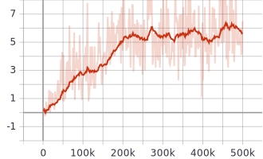

# The Option Keyboard

This is a PyTorch implementation of [The Option Keyboard:
Combining Skills in Reinforcement Learning](https://papers.nips.cc/paper/9463-the-option-keyboard-combining-skills-in-reinforcement-learning)
(NeurIPS 2019).

## Setup

The following packages are required:
- Python 3.5+
- PyTorch (>=1.0.0 with CUDA version 10.0)
- Tensorboard
- NumPy (1.15.4, may work for others)
- OpenAI Gym (>=0.17.1)

To set up the repository, run the following commands:

```
git clone https://github.com/aditimavalankar/option-keyboard.git
cd option-keyboard
pip install -e .
```

## Environment
This repository implements the Foraging World environment discussed in the
paper. 

- State space:
   - 2-D grid containing 3 kinds of food items (blue, green, red), each of which
possesses different proportions of 2 nutrients.
   - Vector containing quantities of nutrients the agent currently has.
- Action space: \{&#8593;, &#8594;, &#8595;, &#8592;\}

In the visualization of the environment below, the agent is
represented by the white square. Since the environment is toroidal, the agent
stays at the same absolute position and the actions are reflected in the
relative movement of the food items. The food items contain nutrients in the
following proportions:

| Food item | Nutrient 1 | Nutrient 2 |
|-----------|------------|------------|
| Blue      | 1          | 0          |
| Green     | 0          | 1          |
| Red       | 1          | 1          |


## Task Description

The agent has to navigate through the grid and collect food items, keeping its
nutrients within a desirable range. The reward that the agent gets on consuming
a food item weighs the nutrients in the food item by their *desirability*. The
difficulty of the task can be adjusted by varying the desirability of the
nutrients the agent possesses at any given time step. The paper discusses two
scenarios with different desirability functions. Results for both scenarios are
included in this repository. More details on the desirability functions can be
found in the paper.

## Algorithm

The algorithm involves 2 main steps:

1. Learning the keyboard
   - The keyboard consists of a set of value functions that give the Q-values
   of all options over all cumulants.
   - Any Q-learning algorithm can be used to learn these value functions; here,
   DQN is used.
2. Learning the player using GPE and GPI over the learnt options
   - Once we have a set of learnt value functions over the given cumulants, we
   can combine them by using GPE and GPI to generate novel options in a
   zero-shot manner.
   - The agent is then left with the task of learning the weights over these
   cumulants to be passed to the Option Keyboard. DQN is used to learn the
   Q-function over the different weight vectors.

Along with OK, a DQN baseline is also implemented for comparison.

## Training

In order to learn the keyboard *and* the player from scratch with default
parameters, run the following command from within the `option_keyboard` directory:

```
python main.py --exp-name option_keyboard
```

If you have a pretrained set of options, and just want to train the player, run
the following command:

```
python main.py --exp-name option_keyboard --pretrained-options /path/to/pretrained/options --n-training-steps-ok 0
```

Other hyperparameters, such as learning rate for the keyboard/player, scenario,
discount factor, etc., as well as pretrained models, can be specified as
command line arguments. To see the full list of command line arguments, run

```
python main.py --help
```

In order to train the baseline DQN, run the following command from within the
`dqn` directory:

```
python main.py --exp-name dqn
```

In order to specify hyperparameters, or resume training from a pretrained model,
please refer to the command line arguments for DQN.

## Testing
Each component of the algorithm can be tested using the scripts in the
`scripts` directory:

- `test_env.py` : check if the environment is functioning as expected
- `test_dqn.py` : check the performance of the DQN at the provided checkpoint
- `test_ok.py` : test the performance of the learnt options over different
values of the weight vector
- `test_overall.py` : test the performance of the learnt player and keyboard at
the provided checkpoints

For instance, to test the performance of the learnt keyboard for *w = (1, -1)*,
and visualize the results, run the following command from within the `scripts`
directory:

```
python test_ok.py --exp-name OK --saved-models /path/to/best/model --visualize --w 1 -1
```

## Results

This section contains results for both parts of the algorithm listed above:
learning the keyboard and learning the player.

#### Learning the Keyboard

When learning the keyboard, the desirability function is not used; instead we
define cumulants for each option (for more details, please refer to the paper).
The returns obtained for different values of *w* can be used to see the quality
of options learnt. Although the original work trains the keyboard for 5 million
time steps, they report that using ~10% of those samples would suffice in order
to learn a good keyboard. Thus, the results reported here are obtained after
training the keyboard for 0.5 million time steps. 

The following plots indicate the reward that the agent accumulants when
*w = (1, 1), w = (1, -1),* and *w = (-1, 1)* respectively.

  

#### Learning the Player

Once we have a keyboard, we can apply GPE and GPI to generate novel options for
different weight vectors *w*. The player learns the value function over these
weight vectors so that the agent can navigate through the grid maintaining
appropriate quantities of its nutrients. The following plots show the learning
curves of the player for scenarios 1 and 2. DQN learning curves are also plotted
for comparison.

In both scenarios, OK (red) outperforms DQN (blue).


## Citation
If you use this work, please consider citing the following paper:
```
@incollection{NIPS2019_9463,
title = {The Option Keyboard: Combining Skills in Reinforcement Learning},
author = {Barreto, Andre and Borsa, Diana and Hou, Shaobo and Comanici, Gheorghe and Ayg\"{u}n, Eser and Hamel, Philippe and Toyama, Daniel and hunt, Jonathan and Mourad, Shibl and Silver, David and Precup, Doina},
booktitle = {Advances in Neural Information Processing Systems 32},
editor = {H. Wallach and H. Larochelle and A. Beygelzimer and F. d\textquotesingle Alch\'{e}-Buc and E. Fox and R. Garnett},
pages = {13052--13062},
year = {2019},
publisher = {Curran Associates, Inc.},
url = {http://papers.nips.cc/paper/9463-the-option-keyboard-combining-skills-in-reinforcement-learning.pdf}
}
```

## Acknowledgements
Many thanks to the authors, especially Shaobo Hou, for all the help in
reproducing the results and providing clarifications on the environment
specifications.